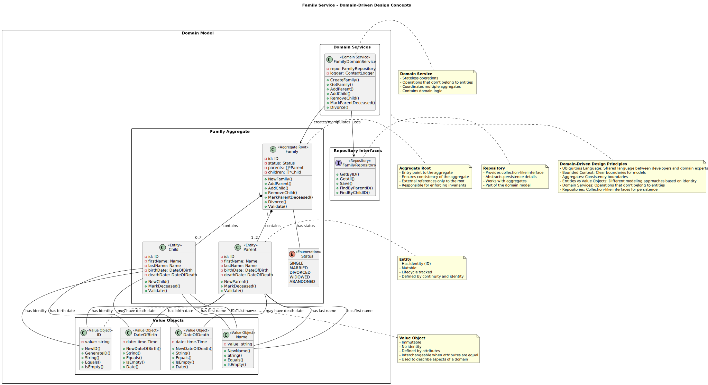
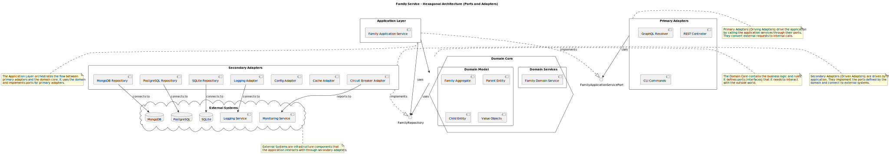

# Software Design Document (SDD)

## Family Service GraphQL

### 1. Introduction

#### 1.1 Purpose
This document describes the software architecture and design for the Family Service GraphQL application, providing a comprehensive guide for developers to understand the system's structure and implementation details.

#### 1.2 Scope
This design document covers the architectural patterns, component interactions, data models, and technical decisions for the Family Service GraphQL application.

#### 1.3 References
- Software Requirements Specification (SRS)
- UML Class Diagram
- UML Sequence Diagram

### 2. Architectural Overview

#### 2.1 Architectural Approach
The Family Service GraphQL application follows a combination of three architectural patterns:

1. **Domain-Driven Design (DDD)**: Focuses on modeling the domain and business logic accurately
2. **Clean Architecture**: Organizes code in concentric layers with dependencies pointing inward
3. **Hexagonal Architecture (Ports and Adapters)**: Isolates the core application from external concerns

#### 2.2 High-Level Architecture Diagram


This diagram illustrates the high-level architecture of the Family Service application, showing the layers of Clean Architecture and how they interact. The diagram demonstrates how the application follows the dependency rule, with all dependencies pointing inward toward the domain layer.

#### 2.3 Design Principles
- **Separation of Concerns**: Each component has a single responsibility
- **Dependency Inversion**: High-level modules don't depend on low-level modules
- **Interface Segregation**: Clients depend only on the interfaces they use
- **Dependency Injection**: Dependencies are provided to components rather than created internally
- **Immutability**: Domain objects are immutable where possible
- **Validation at Boundaries**: Input validation occurs at system boundaries

### 3. Component Design

#### 3.1 Core Domain Layer



This diagram illustrates the Domain-Driven Design concepts used in the Family Service application. It shows the Family Aggregate (with Family as the Aggregate Root, and Parent and Child as Entities), Value Objects (ID, Name, DateOfBirth, DateOfDeath), Domain Services, and Repository interfaces. The diagram also explains key DDD concepts such as Aggregates, Entities, Value Objects, Domain Services, and Repositories.

##### 3.1.1 Aggregates
The domain layer is organized around aggregates, which are clusters of domain objects treated as a single unit:

###### Family Aggregate
- **Root Entity**: `Family`
- **Entities**: `Parent`, `Child`
- **Value Objects**: Dates, Names, IDs
- **Invariants**:
  - A family must have at least one parent
  - A family cannot have more than two parents
  - No duplicate parents in a family
  - Family status must be consistent with parent count

Example Family struct:

    // Family is the root aggregate
    type Family struct {
        id       string // Will be validated using servicelib validation
        status   Status
        parents  []*Parent
        children []*Child
    }

Example Parent struct using ServiceLib value objects:

    // Parent represents a parent entity in the family domain
    type Parent struct {
        id        identification.ID
        firstName identification.Name
        lastName  identification.Name
        birthDate identification.DateOfBirth
        deathDate *identification.DateOfDeath
    }

##### 3.1.2 Domain Services
Domain services implement business logic that doesn't naturally fit within a single entity:

Example Divorce method:

    // Divorce handles the divorce process, creating a new family for the custodial parent
    func (f *Family) Divorce(custodialParentID string) (*Family, error) {
        // Business logic for divorce process
    }

##### 3.1.3 Value Objects
Value objects are immutable and identified by their attributes rather than an identity. The application uses ServiceLib's value objects from the `identification` package:

Example value objects from ServiceLib:

    // ID represents a unique identifier value object
    type ID string

    // Name represents a person's name value object
    type Name string

    // DateOfBirth represents a date of birth value object
    type DateOfBirth struct {
        date time.Time
    }

    // DateOfDeath represents a date of death value object
    type DateOfDeath struct {
        date time.Time
    }

#### 3.2 Application Services Layer

##### 3.2.1 Application Services
The application services layer includes domain services and application services that implement ServiceLib interfaces:

Example FamilyDomainService:

    // FamilyDomainService is a domain service that coordinates operations on the Family aggregate
    type FamilyDomainService struct {
        repo   ports.FamilyRepository
        logger *logging.ContextLogger
    }

Example FamilyApplicationService:

    // FamilyApplicationService implements the application service for family-related use cases
    // It implements the appports.FamilyApplicationService interface and servicelib.di.ApplicationService
    type FamilyApplicationService struct {
        BaseApplicationService[*entity.Family, *entity.FamilyDTO]
        familyService *domainservices.FamilyDomainService
        familyRepo    domainports.FamilyRepository
        logger        *logging.ContextLogger
    }

    // Ensure FamilyApplicationService implements di.ApplicationService
    var _ di.ApplicationService = (*FamilyApplicationService)(nil)

    // GetID returns the service ID (implements di.ApplicationService)
    func (s *FamilyApplicationService) GetID() string {
        return "family-application-service"
    }

Key responsibilities:
- Orchestrating domain operations
- Transaction management
- Input validation
- Error handling and mapping

##### 3.2.2 Data Transfer Objects (DTOs)
DTOs facilitate data exchange between layers:

Example FamilyDTO:

    // FamilyDTO is a data transfer object for the Family aggregate
    type FamilyDTO struct {
        ID       string
        Status   string
        Parents  []parent.ParentDTO
        Children []child.ChildDTO
    }

#### 3.3 Ports Layer

##### 3.3.1 Repository Interfaces
The ports layer defines interfaces for external dependencies, extending ServiceLib's repository interfaces:

Example ServiceLib Repository interface:

    // Repository is a generic repository interface for entity persistence operations
    // from servicelib/repository package
    type Repository[T any] interface {
        // GetByID retrieves an entity by its ID
        GetByID(ctx context.Context, id string) (T, error)

        // GetAll retrieves all entities
        GetAll(ctx context.Context) ([]T, error)

        // Save persists an entity
        Save(ctx context.Context, entity T) error
    }

Example FamilyRepository interface that embeds the ServiceLib Repository:

    // FamilyRepository defines the interface for family persistence operations
    // This interface represents a port in the Hexagonal Architecture pattern
    // It's defined in the domain layer but implemented in the infrastructure layer
    type FamilyRepository interface {
        // Embed the generic Repository interface with Family entity
        repositorywrapper.Repository[*entity.Family]

        // FindByParentID finds families that contain a specific parent
        FindByParentID(ctx context.Context, parentID string) ([]*entity.Family, error)

        // FindByChildID finds the family that contains a specific child
        FindByChildID(ctx context.Context, childID string) (*entity.Family, error)
    }

##### 3.3.2 Application Service Interfaces
The ports layer also defines interfaces for application services, extending ServiceLib's application service interfaces:

Example ServiceLib ApplicationService interface:

    // ApplicationService is a generic interface for application services
    // from servicelib/di package
    type ApplicationService interface {
        // GetID returns the service ID
        GetID() string
    }

Example generic ApplicationService interface:

    // ApplicationService is a generic interface for application services
    type ApplicationService[T any, D any] interface {
        // Create creates a new entity
        Create(ctx context.Context, dto D) (D, error)

        // GetByID retrieves an entity by ID
        GetByID(ctx context.Context, id string) (D, error)

        // GetAll retrieves all entities
        GetAll(ctx context.Context) ([]D, error)
    }

Example FamilyApplicationService interface that embeds both interfaces:

    // FamilyApplicationService defines the interface for family application services
    // This interface represents a port in the Hexagonal Architecture pattern
    // It's defined in the application layer but implemented in the application layer
    // and used by the interface layer
    type FamilyApplicationService interface {
        // Embed the generic ApplicationService interface with Family entity and DTO
        ApplicationService[*entity.Family, *entity.FamilyDTO]

        // Embed the servicelib ApplicationService interface
        di.ApplicationService

        // AddParent adds a parent to a family
        AddParent(ctx context.Context, familyID string, parentDTO entity.ParentDTO) (*entity.FamilyDTO, error)

        // AddChild adds a child to a family
        AddChild(ctx context.Context, familyID string, childDTO entity.ChildDTO) (*entity.FamilyDTO, error)

        // RemoveChild removes a child from a family
        RemoveChild(ctx context.Context, familyID string, childID string) (*entity.FamilyDTO, error)

        // MarkParentDeceased marks a parent as deceased
        MarkParentDeceased(ctx context.Context, familyID string, parentID string, deathDate time.Time) (*entity.FamilyDTO, error)

        // Divorce handles the divorce process
        Divorce(ctx context.Context, familyID string, custodialParentID string) (*entity.FamilyDTO, error)

        // FindFamiliesByParent finds families that contain a specific parent
        FindFamiliesByParent(ctx context.Context, parentID string) ([]*entity.FamilyDTO, error)

        // FindFamilyByChild finds the family that contains a specific child
        FindFamilyByChild(ctx context.Context, childID string) (*entity.FamilyDTO, error)
    }

#### 3.4 Adapters Layer

##### 3.4.1 GraphQL Adapter
The GraphQL adapter provides the API interface, using the application service port:

Example Resolver:

    // Resolver handles GraphQL queries and mutations
    type Resolver struct {
        familySvc appports.FamilyApplicationService
        logger    *logging.ContextLogger
    }

    // NewResolver creates a new resolver
    func NewResolver(familySvc appports.FamilyApplicationService, logger *logging.ContextLogger) *Resolver {
        return &Resolver{
            familySvc: familySvc,
            logger:    logger,
        }
    }

##### 3.4.2 MongoDB Adapter
The MongoDB adapter implements the repository interface for MongoDB, using ServiceLib's database utilities:

Example MongoFamilyRepository:

    // MongoFamilyRepository implements the FamilyRepository interface for MongoDB
    type MongoFamilyRepository struct {
        Collection *mongo.Collection
        logger     *logging.ContextLogger
    }

    // NewMongoFamilyRepository creates a new MongoFamilyRepository
    func NewMongoFamilyRepository(collection *mongo.Collection) *MongoFamilyRepository {
        if collection == nil {
            panic("collection cannot be nil")
        }
        return &MongoFamilyRepository{
            Collection: collection,
        }
    }

##### 3.4.3 PostgreSQL Adapter
The PostgreSQL adapter implements the repository interface for PostgreSQL, using ServiceLib's database utilities:

Example PostgresFamilyRepository:

    // PostgresFamilyRepository implements the FamilyRepository interface for PostgreSQL
    type PostgresFamilyRepository struct {
        DB     *pgxpool.Pool
        logger *logging.ContextLogger
    }

    // NewPostgresFamilyRepository creates a new PostgresFamilyRepository
    func NewPostgresFamilyRepository(db *pgxpool.Pool, logger *logging.ContextLogger) *PostgresFamilyRepository {
        if db == nil {
            panic("database connection cannot be nil")
        }
        if logger == nil {
            panic("logger cannot be nil")
        }
        return &PostgresFamilyRepository{
            DB:     db,
            logger: logger,
        }
    }

##### 3.4.4 SQLite Adapter
The SQLite adapter implements the repository interface for SQLite, using ServiceLib's database utilities:

Example SQLiteFamilyRepository:

    // SQLiteFamilyRepository implements the FamilyRepository interface for SQLite
    type SQLiteFamilyRepository struct {
        DB     *sql.DB
        logger *logging.ContextLogger
    }

    // NewSQLiteFamilyRepository creates a new SQLiteFamilyRepository
    func NewSQLiteFamilyRepository(db *sql.DB, logger *logging.ContextLogger) *SQLiteFamilyRepository {
        if db == nil {
            panic("database connection cannot be nil")
        }
        if logger == nil {
            panic("logger cannot be nil")
        }
        return &SQLiteFamilyRepository{
            DB:     db,
            logger: logger,
        }
    }

#### 3.5 Infrastructure Components

##### 3.5.1 Error Handling
The application uses ServiceLib's error handling package, which provides a comprehensive set of error types for different layers:

Example error types from ServiceLib:

    // Error code constants
    const (
        NotFoundCode              = core.NotFoundCode
        InvalidInputCode          = core.InvalidInputCode
        DatabaseErrorCode         = core.DatabaseErrorCode
        InternalErrorCode         = core.InternalErrorCode
        BusinessRuleViolationCode = core.BusinessRuleViolationCode
        // ... more error codes
    )

    // Domain error creation functions
    func NewDomainError(code ErrorCode, message string, cause error) *DomainError {
        return domain.NewDomainError(code, message, cause)
    }

    func NewValidationError(message string, field string, cause error) *ValidationError {
        return domain.NewValidationError(message, field, cause)
    }

    func NewBusinessRuleError(message string, rule string, cause error) *BusinessRuleError {
        return domain.NewBusinessRuleError(message, rule, cause)
    }

    func NewNotFoundError(resourceType string, resourceID string, cause error) *NotFoundError {
        return domain.NewNotFoundError(resourceType, resourceID, cause)
    }

    // Infrastructure error creation functions
    func NewDatabaseError(message string, operation string, table string, cause error) *DatabaseError {
        return infra.NewDatabaseError(message, operation, table, cause)
    }

    // Application error creation functions
    func NewApplicationError(code ErrorCode, message string, cause error) *ApplicationError {
        return app.NewApplicationError(code, message, cause)
    }

##### 3.5.2 Validation
The application uses ServiceLib's validation package, which provides utilities for validating domain entities:

Example validation utilities from ServiceLib:

    // ValidationResult holds the result of a validation operation
    type ValidationResult struct {
        errors *errors.ValidationErrors
    }

    // NewValidationResult creates a new ValidationResult
    func NewValidationResult() *ValidationResult {
        return &ValidationResult{
            errors: errors.NewValidationErrors("Validation failed"),
        }
    }

    // AddError adds an error to the validation result
    func (v *ValidationResult) AddError(msg, field string) {
        v.errors.AddError(errors.NewValidationError(msg, field, nil))
    }

    // IsValid returns true if there are no validation errors
    func (v *ValidationResult) IsValid() bool {
        return !v.errors.HasErrors()
    }

    // Error returns the validation errors as an error
    func (v *ValidationResult) Error() error {
        if v.IsValid() {
            return nil
        }
        return v.errors
    }

    // ValidateID validates that an ID is not empty
    func ValidateID(id, field string, result *ValidationResult) {
        if strings.TrimSpace(id) == "" {
            result.AddError("is required", field)
        }
    }

##### 3.5.3 Middleware
Middleware for request handling:

Example RequestContext middleware:

    // WithRequestContext adds request context information to the request
    func WithRequestContext(next http.Handler) http.Handler {
        // Implementation
    }

### 4. Data Design

#### 4.1 Data Models

##### 4.1.1 MongoDB Data Model
MongoDB uses an embedded document model:

    Family Document {
        _id: string,
        status: string,
        parents: [
            {
                id: string,
                firstName: string,
                lastName: string,
                birthDate: string,
                deathDate: string (optional)
            }
        ],
        children: [
            {
                id: string,
                firstName: string,
                lastName: string,
                birthDate: string,
                deathDate: string (optional)
            }
        ]
    }

##### 4.1.2 PostgreSQL Data Model
PostgreSQL uses a normalized model with JSON for parent and child data:

    CREATE TABLE families (
        id VARCHAR(36) PRIMARY KEY,
        status VARCHAR(20) NOT NULL,
        parents JSONB NOT NULL,
        children JSONB NOT NULL,
        created_at TIMESTAMP WITH TIME ZONE DEFAULT CURRENT_TIMESTAMP,
        updated_at TIMESTAMP WITH TIME ZONE DEFAULT CURRENT_TIMESTAMP
    );

##### 4.1.3 SQLite Data Model
SQLite uses a similar model to PostgreSQL, with JSON for parent and child data:

    CREATE TABLE IF NOT EXISTS families (
        id TEXT PRIMARY KEY,
        status TEXT NOT NULL,
        parents TEXT NOT NULL,
        children TEXT NOT NULL,
        created_at TIMESTAMP DEFAULT CURRENT_TIMESTAMP,
        updated_at TIMESTAMP DEFAULT CURRENT_TIMESTAMP
    );

#### 4.2 Data Flow

##### 4.2.1 Create Family Sequence


This sequence diagram illustrates the flow of creating a family in the application:
1. GraphQL resolver receives createFamily mutation
2. Input is converted to domain DTO
3. FamilyApplicationService delegates to FamilyDomainService
4. FamilyDomainService creates Family aggregate using servicelib value objects
5. Repository saves Family to database using servicelib database utilities
6. Result is converted back to GraphQL type and returned

##### 4.2.2 Divorce Sequence
1. GraphQL resolver receives divorce mutation
2. FamilyApplicationService delegates to FamilyDomainService
3. FamilyDomainService retrieves Family from repository
4. Family.Divorce() creates new Family for remaining parent (original family keeps custodial parent)
5. Repository saves both families (original and new) using servicelib database utilities
6. Updated Family is returned to client

### 5. Interface Design

#### 5.1 GraphQL Schema
The GraphQL schema defines the API contract:

    type Family {
      id: ID!
      status: FamilyStatus!
      parents: [Parent!]!
      children: [Child!]!
    }

    type Mutation {
      createFamily(input: FamilyInput!): Family!
      addParent(familyId: ID!, input: ParentInput!): Family!
      addChild(familyId: ID!, input: ChildInput!): Family!
      removeChild(familyId: ID!, childId: ID!): Family!
      markParentDeceased(familyId: ID!, parentId: ID!, deathDate: String!): Family!
      divorce(familyId: ID!, custodialParentId: ID!): Family!
    }

    type Query {
      getFamily(id: ID!): Family
      findFamiliesByParent(parentId: ID!): [Family!]
      findFamilyByChild(childId: ID!): Family
    }

### 6. Error Handling Design

#### 6.1 Error Types
- **ValidationError**: For input validation failures
- **DomainError**: For business rule violations
- **NotFoundError**: For resource not found situations
- **RepositoryError**: For data access issues
- **ApplicationError**: For general application errors

#### 6.2 Error Propagation
Errors are propagated up the call stack and transformed as needed:
1. Domain layer generates domain-specific errors
2. Application services wrap and enrich errors with context
3. GraphQL resolver maps errors to GraphQL-friendly format

### 7. Performance Considerations

#### 7.1 Database Optimization
- MongoDB uses embedded documents for efficient retrieval
- PostgreSQL uses JSONB for flexible querying with indexes
- SQLite uses JSON stored as TEXT for simple, file-based storage
- All implementations use ServiceLib's database utilities for connection pooling, retries, and error handling
- All implementations support efficient lookups by ID

#### 7.2 Circuit Breaker Pattern

The application implements the Circuit Breaker pattern to prevent cascading failures when external dependencies (such as databases) are unavailable or experiencing high latency. This pattern helps to maintain system stability and responsiveness.

##### 7.2.1 Circuit Breaker Implementation

The circuit breaker is implemented in the `infrastructure/adapters/circuit` package, which provides a wrapper around the ServiceLib circuit breaker:

```
// CircuitBreaker implements the circuit breaker pattern to protect against
// cascading failures when external dependencies are unavailable.
type CircuitBreaker struct {
    name   string
    cb     *circuit.CircuitBreaker
    logger *zap.Logger
}
```

The circuit breaker can be in one of three states:
- **Closed**: Normal operation, requests are allowed through
- **Open**: Circuit is tripped, requests are immediately rejected
- **HalfOpen**: Testing if the dependency has recovered, allowing a limited number of requests through

##### 7.2.2 Circuit Breaker Configuration

The circuit breaker is configured through the application configuration:

```
circuit:
  enabled: true              # Whether the circuit breaker is enabled
  timeout: 1s                # Maximum time allowed for a request
  max_concurrent: 100        # Maximum number of concurrent requests
  error_threshold: 0.5       # Error rate threshold (0.0-1.0) that trips the circuit
  volume_threshold: 10       # Minimum number of requests before error threshold is considered
  sleep_window: 5s           # Time to wait before allowing requests when circuit is open
```

The configuration can be overridden using environment variables:

```
APP_CIRCUIT_ENABLED=true
APP_CIRCUIT_TIMEOUT=1s
APP_CIRCUIT_MAX_CONCURRENT=100
APP_CIRCUIT_ERROR_THRESHOLD=0.5
APP_CIRCUIT_VOLUME_THRESHOLD=10
APP_CIRCUIT_SLEEP_WINDOW=5s
```

##### 7.2.3 Usage in Repository Implementations

The circuit breaker is used in the MongoDB and SQLite repository implementations to protect against database failures:

```
// Execute with circuit breaker
_, err := circuit.Execute(ctx, r.circuitBreaker, "GetByID", circuitOpWrapper)
```

Each repository operation is wrapped with the circuit breaker, which will:
1. Check if the circuit is open (if so, immediately return an error)
2. Execute the operation if the circuit is closed or half-open
3. Update circuit state based on the result (success or failure)
4. Return the result or an error

##### 7.2.4 Error Handling

When the circuit is open, operations return a specific error that is converted to a database error:

```
// Check for errors from circuit breaker
if err == recovery.ErrCircuitBreakerOpen {
    return nil, errors.NewDatabaseError("circuit breaker is open", "query", "families", err)
}
```

This allows the application to distinguish between actual database errors and circuit breaker rejections.

##### 7.2.5 Fallback Mechanism

The circuit breaker implementation also supports a fallback mechanism, which allows the application to provide alternative behavior when the circuit is open:

```
// Execute with fallback
err := cb.ExecuteWithFallback(ctx, "operation", func(ctx context.Context) error {
    // Primary operation
    return primaryOperation(ctx)
}, func(ctx context.Context, err error) error {
    // Fallback operation
    return fallbackOperation(ctx)
})
```

This is useful for operations that can be gracefully degraded, such as returning cached data instead of querying the database.

#### 7.3 Retry Configuration
The application includes configurable retry logic for database operations to handle transient errors:

```yaml
retry:
  max_retries: 3              # Maximum number of retry attempts
  initial_backoff: 100ms      # Initial backoff duration before the first retry
  max_backoff: 1s             # Maximum backoff duration for any retry
```

The retry configuration is defined in the application configuration files and can be overridden using environment variables:

```env
APP_RETRY_MAX_RETRIES=3
APP_RETRY_INITIAL_BACKOFF=100ms
APP_RETRY_MAX_BACKOFF=1s
```

The retry logic is implemented in all repository adapters (MongoDB, PostgreSQL, SQLite) and uses an exponential backoff strategy with jitter to prevent thundering herd problems. The retry mechanism automatically handles transient errors such as network issues, timeouts, and temporary database unavailability.

Retries are only attempted for operations that are safe to retry (idempotent operations) and for specific error types that are likely to be transient. Permanent errors such as validation failures or not found errors are not retried.

#### 7.2 Caching Strategy
- No caching implemented in the current version
- Future versions could add caching at the repository or service layer

### 8. Security Considerations

#### 8.1 Input Validation
All inputs are validated at multiple levels:
- GraphQL schema validation
- Application service validation
- Domain entity validation

##### 8.1.1 Domain Entity Validation
The domain entities implement comprehensive validation rules:

###### Family Entity Validation
- Basic structural validation:
  - Family must have at least one parent
  - Family cannot have more than two parents
  - No duplicate parents (based on name and birth date)
- Status validation:
  - Married families must have exactly two parents
  - Single families cannot have more than one parent
  - Divorced families must have exactly one parent
  - Widowed families must have exactly one parent and that parent cannot be deceased
  - Abandoned families must have at least one child
- Parent validation:
  - Parents must be at least 18 years old
- Child validation:
  - Children's birth dates must be after their parents' birth dates
  - Children's birth dates cannot be in the future
- Parent-child relationship validation:
  - Minimum 12-year age gap between parents and children

###### Parent Entity Validation
- Name validation:
  - First and last names must be at least 2 characters long
  - Names must contain only letters, spaces, and hyphens
- Date validation:
  - Birth date cannot be in the future
  - Death date must be after birth date
  - Death date cannot be in the future
- Age validation:
  - Minimum age of 18 years
  - Maximum age of 150 years

###### Child Entity Validation
- Name validation:
  - First and last names must be at least 2 characters long
  - Names must contain only letters, spaces, and hyphens
- Date validation:
  - Birth date cannot be in the future
  - Death date must be after birth date
  - Death date cannot be in the future
- Age validation:
  - Maximum age of 150 years

#### 8.2 Error Information Exposure
Error messages are sanitized before being returned to clients to prevent information leakage.

### 9. Monitoring and Observability Design

#### 9.1 Telemetry Architecture

The Family Service implements a comprehensive monitoring and observability solution using OpenTelemetry for instrumentation and Prometheus/Grafana for metrics collection and visualization.

##### 9.1.1 Components

- **OpenTelemetry SDK**: Provides the foundation for metrics collection and distributed tracing
- **Prometheus**: Time-series database for storing metrics
- **Grafana**: Visualization platform for metrics dashboards

##### 9.1.2 Architecture Diagram



This diagram illustrates the hexagonal architecture (ports and adapters pattern) of the Family Service application. It shows how the domain core is isolated from external concerns through ports (interfaces) and adapters. The primary adapters drive the application by calling the application services, while the secondary adapters are driven by the application and connect to external systems.

#### 9.2 Instrumentation Design

##### 9.2.1 Metrics Collection

The application uses the OpenTelemetry SDK to collect various metrics:

- **Runtime Metrics**: Memory usage, goroutines, GC statistics
- **HTTP Metrics**: Request counts, durations, error rates
- **Database Metrics**: Query counts, durations, connection pool stats
- **Domain Operation Metrics**: Counts and durations for domain operations
- **Repository Operation Metrics**: Counts and durations for repository operations
- **Family Metrics**: Counts of family members and families by status
- **Circuit Breaker Metrics**: Circuit state changes, rejection counts, success/failure rates
- **Application Metrics**: Business-specific metrics and error counts

Example metrics implementation:

    // Initialize metrics
    httpRequestsTotal, _ := meter.Int64Counter(
        "http_requests_total",
        metric.WithDescription("Total number of HTTP requests"),
    )

    // Record metrics
    httpRequestsTotal.Add(ctx, 1, 
        attribute.String("method", "GET"),
        attribute.String("path", "/api/families"),
        attribute.Int("status", 200),
    )

###### Domain Operation Metrics

The application includes comprehensive metrics for domain operations:

```
// Family operations counters
var FamilyOperationsTotal = prometheus.NewCounterVec(
    prometheus.CounterOpts{
        Name: "family_operations_total",
        Help: "Total number of family domain operations",
    },
    []string{"operation", "status"},
)

// Family operations duration
var FamilyOperationsDuration = prometheus.NewHistogramVec(
    prometheus.HistogramOpts{
        Name:    "family_operations_duration_seconds",
        Help:    "Duration of family domain operations in seconds",
        Buckets: prometheus.DefBuckets,
    },
    []string{"operation"},
)

// Family member counts
var FamilyMemberCounts = prometheus.NewGaugeVec(
    prometheus.GaugeOpts{
        Name: "family_member_counts",
        Help: "Current count of family members by type",
    },
    []string{"type"},
)

// Family status counts
var FamilyStatusCounts = prometheus.NewGaugeVec(
    prometheus.GaugeOpts{
        Name: "family_status_counts",
        Help: "Current count of families by status",
    },
    []string{"status"},
)
```

These metrics track:
- Success and failure counts for all domain operations (create_family, get_family, add_parent, add_child, remove_child, mark_parent_deceased, divorce)
- Duration of domain operations
- Current counts of parents and children
- Current counts of families by status (single, married, divorced, widowed)

###### Repository Operation Metrics

The application also tracks metrics for repository operations:

```
// Repository operation metrics
var RepositoryOperationsTotal = prometheus.NewCounterVec(
    prometheus.CounterOpts{
        Name: "repository_operations_total",
        Help: "Total number of repository operations",
    },
    []string{"operation", "status"},
)

// Repository operations duration
var RepositoryOperationsDuration = prometheus.NewHistogramVec(
    prometheus.HistogramOpts{
        Name:    "repository_operations_duration_seconds",
        Help:    "Duration of repository operations in seconds",
        Buckets: prometheus.DefBuckets,
    },
    []string{"operation"},
)
```

These metrics track:
- Success and failure counts for all repository operations (save, get_by_id, get_all, find_by_parent_id, find_by_child_id)
- Duration of repository operations

###### Circuit Breaker Metrics

The application also tracks metrics for circuit breakers:

```
// Circuit breaker state metrics
var CircuitBreakerState = prometheus.NewGaugeVec(
    prometheus.GaugeOpts{
        Name: "circuit_breaker_state",
        Help: "Current state of circuit breakers (0=closed, 1=open, 2=half-open)",
    },
    []string{"name"},
)

// Circuit breaker rejection metrics
var CircuitBreakerRejections = prometheus.NewCounterVec(
    prometheus.CounterOpts{
        Name: "circuit_breaker_rejections_total",
        Help: "Total number of requests rejected by circuit breakers",
    },
    []string{"name"},
)

// Circuit breaker success/failure metrics
var CircuitBreakerResults = prometheus.NewCounterVec(
    prometheus.CounterOpts{
        Name: "circuit_breaker_results_total",
        Help: "Total number of circuit breaker results",
    },
    []string{"name", "result"},
)
```

These metrics track:
- Current state of each circuit breaker (closed, open, half-open)
- Number of requests rejected by each circuit breaker
- Success and failure counts for operations protected by circuit breakers

##### 9.2.2 Middleware Integration

HTTP middleware automatically collects metrics for all requests:

    // HTTP middleware for metrics collection
    func MetricsMiddleware(next http.Handler) http.Handler {
        return http.HandlerFunc(func(w http.ResponseWriter, r *http.Request) {
            start := time.Now()

            // Call the next handler
            next.ServeHTTP(w, r)

            // Record metrics after the request is processed
            duration := time.Since(start)
            RecordHTTPRequest(r.Context(), r.Method, r.URL.Path, w.Status(), duration)
        })
    }

##### 9.2.3 Database Instrumentation

Database operations are instrumented to track performance:

    // Record database operation metrics
    func RecordDBOperation(ctx context.Context, operation, database string, duration time.Duration, err error) {
        dbOperationsTotal.Add(ctx, 1,
            attribute.String("operation", operation),
            attribute.String("database", database),
            attribute.Bool("success", err == nil),
        )

        dbOperationDuration.Record(ctx, duration.Seconds(),
            attribute.String("operation", operation),
            attribute.String("database", database),
        )
    }

#### 9.3 Distributed Tracing

The application uses OpenTelemetry for distributed tracing, providing detailed insights into the execution flow of complex operations.

##### 9.3.1 Domain Operation Tracing

Each domain operation is instrumented with tracing spans to track its execution:

```
// Start a new span for this operation
ctx, span := s.tracer.Start(ctx, "FamilyDomainService.CreateFamily")
defer span.End()
```

##### 9.3.2 Complex Workflow Tracing

Complex workflows like the divorce process have detailed tracing with nested spans for each step:

```
// Main operation span
ctx, span := s.tracer.Start(ctx, "FamilyDomainService.Divorce")
defer span.End()

// Repository operation span
ctx, getSpan := s.tracer.Start(ctx, "Repository.GetByID.Divorce")
// ... repository operation ...
getSpan.End()

// Domain logic span
ctx, divorceLogicSpan := s.tracer.Start(ctx, "Domain.DivorceLogic")
// ... domain logic ...
divorceLogicSpan.End()

// Save custodial parent family span
ctx, saveCustodialSpan := s.tracer.Start(ctx, "Repository.Save.CustodialFamily")
// ... save operation ...
saveCustodialSpan.End()

// Save remaining parent family span
ctx, saveRemainingSpan := s.tracer.Start(ctx, "Repository.Save.RemainingFamily")
// ... save operation ...
saveRemainingSpan.End()
```

This detailed tracing provides visibility into:
- The overall duration of complex operations
- The time spent in each step of the workflow
- Potential bottlenecks in the execution path
- Error points in the workflow

#### 9.4 Metrics Exposure

The application exposes metrics through a `/metrics` endpoint in Prometheus format. This endpoint is automatically scraped by Prometheus at regular intervals.

#### 9.5 Visualization

A custom Grafana dashboard (`grafana_dashboard_for_family_service.json`) provides visualization of key metrics:

- Heap allocations over time
- HTTP request rates and durations
- Database operation performance
- Domain operation performance and counts
- Family member and status counts
- Error rates

The dashboard includes panels specifically for the new domain operation metrics:

- Family operation success/failure rates
- Family operation duration distributions
- Repository operation success/failure rates
- Repository operation duration distributions
- Circuit breaker state changes and rejection rates
- Family member counts by type (parents/children)
- Family status distribution (single/married/divorced/widowed)

Additionally, the dashboard includes a tracing panel that visualizes the execution flow of complex operations like the divorce process, showing the time spent in each step of the workflow.

The dashboard is designed to provide insights into the application's performance and health, allowing for proactive monitoring and troubleshooting.

#### 9.6 Alerting

The monitoring system supports alerting based on metric thresholds:

- High error rates in domain operations
- Elevated operation durations
- Memory usage spikes
- Database connection pool exhaustion
- Circuit breaker state changes (open, half-open)
- High rejection rates from circuit breakers
- High failure rates for specific operations (e.g., divorce process)
- Unusual changes in family member counts
- Unusual changes in family status distribution

Alerts can be configured in Grafana to notify operators via email, Slack, or other channels when predefined conditions are met.

### 10. Deployment View

#### 10.1 Components
- Family Service GraphQL application
- MongoDB database
- PostgreSQL database

#### 10.2 Deployment Architecture
The application is deployed as Docker containers using docker-compose:
- Application container
- MongoDB container
- PostgreSQL container

#### 10.3 Secrets Management
The application requires a `secrets` folder containing credential files for various services:
- Grafana admin credentials
- PostgreSQL credentials
- MongoDB credentials
- Redis credentials

These secrets are mounted into the application container at runtime and are used to authenticate with the respective services. For details on setting up the secrets folder, see the [Secrets Setup Guide](Secrets_Setup_Guide.md).

### 11. Development Considerations

#### 11.1 Build and Test Process
- Go modules for dependency management
- Makefile for common development tasks
- Unit tests for domain logic
- Integration tests for repositories
- End-to-end tests for GraphQL API

#### 11.2 Development Environment Setup
- Docker and docker-compose for local development
- Environment variables for configuration
- GraphQL Playground for API exploration

### 12. Appendices

#### 12.1 Architecture Diagrams

##### 12.1.1 Clean Architecture Overview


This diagram illustrates the high-level architecture of the Family Service application, showing the layers of Clean Architecture and how they interact. The diagram demonstrates how the application follows the dependency rule, with all dependencies pointing inward toward the domain layer.

##### 12.1.2 Hexagonal Architecture (Ports and Adapters)


This diagram illustrates the hexagonal architecture (ports and adapters pattern) of the Family Service application. It shows how the domain core is isolated from external concerns through ports (interfaces) and adapters. The primary adapters drive the application by calling the application services, while the secondary adapters are driven by the application and connect to external systems.

##### 12.1.3 Deployment Container Diagram


This diagram shows the Docker Compose environment for the Family Service application, including the main service container, database containers, volumes, and network configuration.

#### 12.2 Domain Model Diagrams

##### 12.2.1 Domain-Driven Design Concepts


This diagram illustrates the Domain-Driven Design concepts used in the Family Service application. It shows the Family Aggregate (with Family as the Aggregate Root, and Parent and Child as Entities), Value Objects (ID, Name, DateOfBirth, DateOfDeath), Domain Services, and Repository interfaces. The diagram also explains key DDD concepts such as Aggregates, Entities, Value Objects, Domain Services, and Repositories.

##### 12.2.2 UML Class Diagram


This class diagram illustrates the detailed structure of the system, showing the classes in each layer (Domain, Service, Ports, Adapters) and the relationships between them. It demonstrates how the system follows the architectural patterns described in this document.

#### 12.3 Sequence Diagrams

##### 12.3.1 Create Family Sequence


This sequence diagram illustrates the flow of creating a family in the application, from the API request through the application and domain layers to the database, and back to the client.

##### 12.3.2 Divorce Operation Sequence


This sequence diagram shows the interactions between components during the Divorce operation, one of the more complex workflows in the system. It illustrates how the different layers work together to process this operation, from the API request to the database updates.
