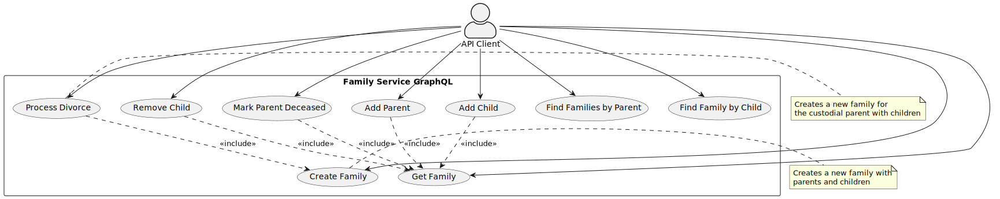
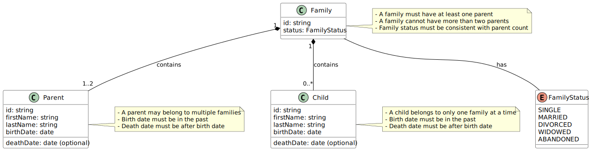

# Software Requirements Specification (SRS)

## Family Service GraphQL

### 1. Introduction

#### 1.1 Purpose
This document specifies the software requirements for the Family Service GraphQL application, a backend service designed to track and manage family relationships using modern software engineering principles.

#### 1.2 Scope
The Family Service GraphQL application provides a GraphQL API for creating, reading, updating, and deleting family records, including parents and children. It supports complex family structures and transitions such as marriage, divorce, remarriage, and death.

#### 1.3 Definitions, Acronyms, and Abbreviations
- **DDD**: Domain-Driven Design
- **GraphQL**: A query language for APIs
- **CRUD**: Create, Read, Update, Delete
- **API**: Application Programming Interface

### 2. Overall Description

#### 2.1 Product Perspective
The Family Service GraphQL is a standalone backend service that can be integrated with various frontend applications. It provides a GraphQL API for managing family data and supports both MongoDB and PostgreSQL as data stores.

#### 2.2 Product Functions
The system provides the following key functions:
- Create, read, update, and delete family records
- Add and remove parents and children from families
- Track family status changes (single, married, divorced, widowed)
- Process complex events like divorce and death
- Validate family data according to business rules

#### 2.3 User Classes and Characteristics
- **API Clients**: Frontend applications or other services that interact with the Family Service GraphQL API
- **Administrators**: Users who manage the deployment and operation of the service

#### 2.4 Operating Environment
- The service runs in a containerized environment using Docker
- Supports both MongoDB and PostgreSQL as data stores
- Requires Go 1.24 or higher

#### 2.5 Design and Implementation Constraints
- Follows Domain-Driven Design (DDD) principles
- Implements Clean Architecture and Hexagonal Architecture patterns
- Uses GraphQL for API interactions
- Must support both document-based (MongoDB) and relational (PostgreSQL) data models

#### 2.6 Assumptions and Dependencies
- Assumes the availability of either MongoDB or PostgreSQL
- Depends on Go 1.24+ runtime environment
- Requires a properly configured `secrets` folder with necessary credential files (see [Secrets Setup Guide](Secrets_Setup_Guide.md))

### 3. Specific Requirements

#### 3.1 External Interface Requirements

##### 3.1.1 User Interfaces
- GraphQL Playground for interactive API exploration at `/`
- GraphQL API endpoint at `/query`
- Health check endpoint at `/healthz`

##### 3.1.2 Hardware Interfaces
- No specific hardware interfaces required

##### 3.1.3 Software Interfaces
- MongoDB 6.0+ or PostgreSQL 15.0+
- Docker for containerized deployment

##### 3.1.4 Communications Interfaces
- HTTP/HTTPS for GraphQL API communication

#### 3.2 Functional Requirements

##### 3.2.1 Family Management

###### 3.2.1.1 Create Family
- **Description**: Create a new family with parents and children
- **Inputs**: Family data including ID, status, parents, and children
- **Processing**: Validate family data according to business rules
- **Outputs**: Created family data
- **Error Handling**: Return validation errors if family data is invalid

###### 3.2.1.2 Get Family
- **Description**: Retrieve a family by ID
- **Inputs**: Family ID
- **Processing**: Look up family in the database
- **Outputs**: Family data if found
- **Error Handling**: Return not found error if family doesn't exist

###### 3.2.1.3 Add Parent
- **Description**: Add a parent to an existing family
- **Inputs**: Family ID, parent data
- **Processing**: Validate parent data, check for duplicates, update family status if needed
- **Outputs**: Updated family data
- **Error Handling**: Return validation errors if parent data is invalid or if family already has two parents

###### 3.2.1.4 Add Child
- **Description**: Add a child to an existing family
- **Inputs**: Family ID, child data
- **Processing**: Validate child data, check for duplicates
- **Outputs**: Updated family data
- **Error Handling**: Return validation errors if child data is invalid or if child already exists in the family

###### 3.2.1.5 Remove Child
- **Description**: Remove a child from a family
- **Inputs**: Family ID, child ID
- **Processing**: Remove child from family
- **Outputs**: Updated family data
- **Error Handling**: Return not found error if child doesn't exist in the family

###### 3.2.1.6 Mark Parent Deceased
- **Description**: Mark a parent as deceased
- **Inputs**: Family ID, parent ID, death date
- **Processing**: Update parent's death date, update family status if needed
- **Outputs**: Updated family data
- **Error Handling**: Return validation errors if death date is invalid or if parent is already deceased

###### 3.2.1.7 Divorce
- **Description**: Process a divorce, creating a new family for the custodial parent
- **Inputs**: Family ID, custodial parent ID
- **Processing**: Create a new family for the custodial parent with all children, update original family
- **Outputs**: New family data
- **Error Handling**: Return validation errors if family is not in a married state or if custodial parent doesn't exist

##### 3.2.2 Query Operations

###### 3.2.2.1 Find Families by Parent
- **Description**: Find all families that contain a specific parent
- **Inputs**: Parent ID
- **Processing**: Search for families containing the parent
- **Outputs**: List of families
- **Error Handling**: Return empty list if no families are found

###### 3.2.2.2 Find Family by Child
- **Description**: Find the family that contains a specific child
- **Inputs**: Child ID
- **Processing**: Search for the family containing the child
- **Outputs**: Family data if found
- **Error Handling**: Return not found error if no family contains the child

#### 3.3 Non-Functional Requirements

##### 3.3.1 Performance Requirements
- API response time should be under 500ms for 95% of requests
- Should support at least 100 concurrent users
- Database operations should be optimized for both MongoDB and PostgreSQL

##### 3.3.2 Safety Requirements
- All data validation must occur in both the application and domain layers
- Transactions must be used for operations that modify multiple records

##### 3.3.3 Security Requirements
- Input validation to prevent injection attacks
- Error messages should not expose sensitive information
- API endpoints should be secured in production environments

##### 3.3.4 Software Quality Attributes
- **Maintainability**: Code should follow DDD, Clean Architecture, and Hexagonal Architecture principles
- **Testability**: All components should be testable in isolation
- **Reliability**: The system should handle errors gracefully and provide meaningful error messages
- **Availability**: The system should be designed for high availability with proper error handling and recovery

### 4. Domain Rules and Constraints

#### 4.1 Family Structure Rules
- A family must contain at least one parent
- A family cannot have more than two parents
- Children may not exist without belonging to a family
- A parent may belong to multiple families (due to divorce/remarriage)
- A child belongs to only one family at a time

#### 4.2 Family Status Rules
- Family lifecycle states: `single`, `married`, `divorced`, `widowed`, `abandoned`
- A single family must have exactly one parent
- A married family must have exactly two parents
- On divorce: a new family is created for the custodial parent and children

#### 4.3 Person Rules
- Each person (parent or child) must have a first name, last name, and birthdate
- Death date is optional
- No duplicate parents in a family (based on name + birthdate)
- Birth date must be in the past
- Death date, if present, must be after birth date and in the past

### 5. Appendices

#### 5.1 Use Case Diagrams

This use case diagram illustrates the interactions between the API client and the Family Service GraphQL system, showing all the main operations that can be performed.

#### 5.2 Data Models

This data model diagram shows the key entities in the system (Family, Parent, Child) and their relationships, along with the business rules that govern them.

#### 5.3 API Reference
The GraphQL API provides the following operations:

**Queries:**
- `getFamily(id: ID!): Family`
- `findFamiliesByParent(parentId: ID!): [Family!]`
- `findFamilyByChild(childId: ID!): Family`

**Mutations:**
- `createFamily(input: FamilyInput!): Family!`
- `addParent(familyId: ID!, input: ParentInput!): Family!`
- `addChild(familyId: ID!, input: ChildInput!): Family!`
- `removeChild(familyId: ID!, childId: ID!): Family!`
- `markParentDeceased(familyId: ID!, parentId: ID!, deathDate: String!): Family!`
- `divorce(familyId: ID!, custodialParentId: ID!): Family!`
